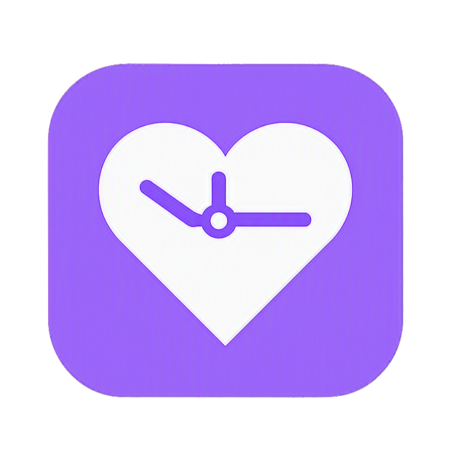

<p align="center">
  
</p>

# Screen Health Guardian

[English](README.md) | [Español](README.es.md)


---


### Project Description
A high-performance, ultra-lightweight Windows desktop application designed to promote ocular and postural wellness. It monitors real user activity via native Win32 APIs, pausing reminder timers automatically whenever the user is away from the keyboard or mouse.

### Key Features

| Alert | Default Interval | Purpose |
|---|---|---|
| 👀 **Eye Rest** | 20 minutes | 20-20-20 rule — look 20 feet away for 20 seconds |
| 🧘 **Posture Check** | 45 minutes | Sit up straight & relax shoulders reminder |

- **Native Win32 Activity Detection**: Uses `GetLastInputInfo` to track real user engagement without polling overhead.
- **Hardware-Accelerated Overlays**: Smooth WPF semi-transparent overlays with progress countdown and auto-dismiss.
- **Modern System Tray**: Powered by `H.NotifyIcon` with interactive tooltips and live time indicators.
- **Persistent Preferences**: JSON-based settings saved to `%APPDATA%\ScreenHealthGuardian\config.json`.
- **Zero Antivirus False Positives**: Native PE executable built with .NET.
- **Dual Language**: Instant hot-reload switching between English and Spanish.

### 💡 Key Learnings & Architectural Evolution (Python ➡️ C# / .NET)

The application originally started as a Python (Tkinter + ctypes + PyInstaller) project and was intentionally refactored and migrated to a native **C# / .NET 9 (WPF)** architecture. This transition provided critical engineering lessons:

1. **Eliminating Antivirus False Positives (Distribution Reliability)**:
   - *Problem in Python*: PyInstaller's compressed bootloader extracts files into `%TEMP%` on startup, which frequently triggers heuristic flags in Windows Defender and corporate antivirus scanners.
   - *Solution in .NET*: Compiling to a standard Portable Executable (PE) via `dotnet publish -p:PublishSingleFile=true` produces clean binaries with zero heuristic alerts and instant startup times.

2. **Resource Optimization for Background Services**:
   - *Memory Footprint*: Reduced continuous working set RAM from **~45–55 MB** (CPython runtime + Tcl/Tk) down to **~12–16 MB** with .NET 9.
   - *CPU Overhead*: Replaced Python GIL thread synchronization with native `DispatcherTimer` loops, keeping background CPU load strictly under **0.1%**.

3. **UI Fidelity & Hardware Acceleration**:
   - Tkinter canvas elements lack native anti-aliasing and struggle with multi-monitor mixed-DPI scaling.
   - Migrating to WPF XAML enabled hardware-accelerated translucent overlays (`AllowsTransparency="True"`), native DWM window composition, and smooth fade-in animations that blend seamlessly into Windows 11.

4. **Robust OS Integration & Concurrency**:
   - Replaced a fragile local TCP socket lock with a Win32 `System.Threading.Mutex` (`Local\ScreenHealthGuardian_SingleInstance_Mutex`), preventing port collisions and firewall popups.
   - Decoupled the system tray lifecycle using `H.NotifyIcon.Wpf`, eliminating the need for complex cross-thread UI queue polling.

### Building & Running

#### Prerequisites
- Windows 10/11
- [.NET 8.0 or 9.0 SDK](https://dotnet.microsoft.com/download)

```powershell
# Run in development mode
dotnet run --project src/ScreenHealthGuardian.csproj

# Build standalone installer & single-file release
./build.bat
```

---

---

## License

This project is licensed under the MIT License. See [LICENSE](LICENSE) for details.

