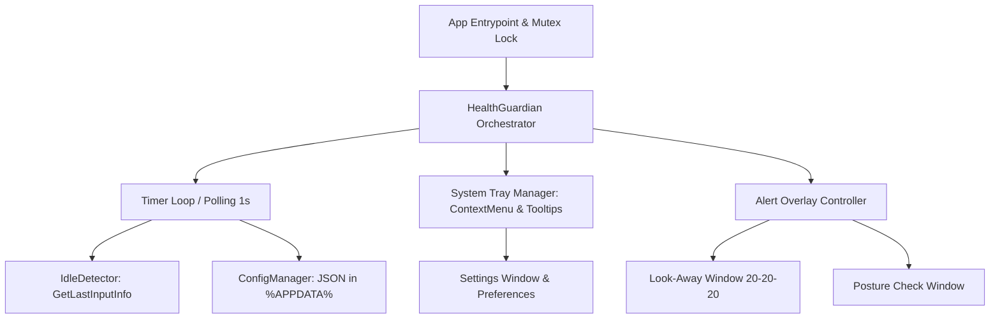

# Technical Investigation: Stack Migration for Screen Health Guardian

> **Created:** 2026-08-19  
> **Last Updated:** 2026-08-19  
> **Status:** Completed Research Document

---

## 1. Overview & Objectives

This document summarizes the technical research and architecture discovery for migrating **Screen Health Guardian** from its current Python runtime (`Python 3.11 + Tkinter + ctypes + pystray + PyInstaller`) to a modern, high-performance native desktop stack.

### Key Objectives
1. **Zero Antivirus False Positives**: Eliminate heuristic flags caused by PyInstaller bootloaders.
2. **Minimal Resource Footprint**: Reduce background memory from ~35-55 MB down to < 15 MB, with < 0.1% CPU.
3. **Fluent Windows 11 Design**: Support modern dark/light themes, smooth fade animations, hardware acceleration, and seamless multimonitor DPI scaling.
4. **Reliable System Integrations**: Native idle detection (`GetLastInputInfo`), tray icon integration, and single-instance control via Win32 Mutex.

---

## 2. Target Technology Evaluation

### Alternative 1: C# / .NET 9 (WPF / WinUI 3)
- **Runtime Model:** Native AOT / Self-contained or standard .NET 9 Desktop Runtime.
- **UI Frameworks:**
  - **WPF (.NET 9):** Mature, extremely stable, full control over borderless top-most overlays (`WindowStyle="None"`, `AllowsTransparency="True"`, `Topmost="True"`), full hardware acceleration, extensive styling support for Windows 11 dark/light themes.
  - **System Tray:** `H.NotifyIcon.Wpf` (modern, supports XAML menus, taskbar positioning, and tooltips).
  - **Win32 Integration:** `P/Invoke` (or `CsWin32` source generator) for `GetLastInputInfo`, `CreateMutexW`, `SetWindowPos`.
- **Memory Footprint:** ~12–18 MB working set.
- **Development Tooling:** Requires `.NET 9 SDK` (`Microsoft.DotNet.SDK.9`).

### Alternative 2: Rust (Native Win32 + Slint / `windows-rs`)
- **Runtime Model:** Pure native binary (PE executable).
- **Tooling State on System:** `rustc 1.97.0` & `cargo 1.97.0` are installed and ready.
- **UI Frameworks:**
  - `slint` (GPU-accelerated, lightweight DSL for UI, compiles to native C++/Rust).
  - `tray-icon` crate + `windows-rs` for native Win32 idle hooks (`GetLastInputInfo`) and single-instance mutex.
- **Memory Footprint:** ~2–6 MB working set.
- **Binary Size:** ~3–6 MB standalone.

---

## 3. Core Architectural Modules for Migration

Whether implemented in C# .NET or Rust, the architecture maps 1:1 with the proven domain logic:

### Module Specifications

1. **Single-Instance Enforcement:**
   - Win32 API `CreateMutexW(IntPtr.Zero, true, "Local\\ScreenHealthGuardian_SingleInstance_Mutex")`.
   - Replaces fragile TCP socket lock.

2. **Idle Detection Engine:**
   - Calls `user32.dll!GetLastInputInfo` and `kernel32.dll!GetTickCount64` (or unsigned 32-bit tick delta).
   - If `(current_tick - last_input) < idle_threshold`, user is active $\rightarrow$ increment active counters.
   - If idle exceeds threshold $\rightarrow$ reset active counters to 0.

3. **Overlay & UI Notifications:**
   - Borderless topmost window centered on the active screen.
   - Non-stealing focus (so user typing isn't abruptly interrupted unless dismissed).
   - Smooth fade-in animation and auto-dismiss countdown bar.

4. **Persistence & Localization:**
   - `%APPDATA%\ScreenHealthGuardian\config.json`.
   - Dual-language support (`en`, `es`) with hot-reloading upon setting change.
